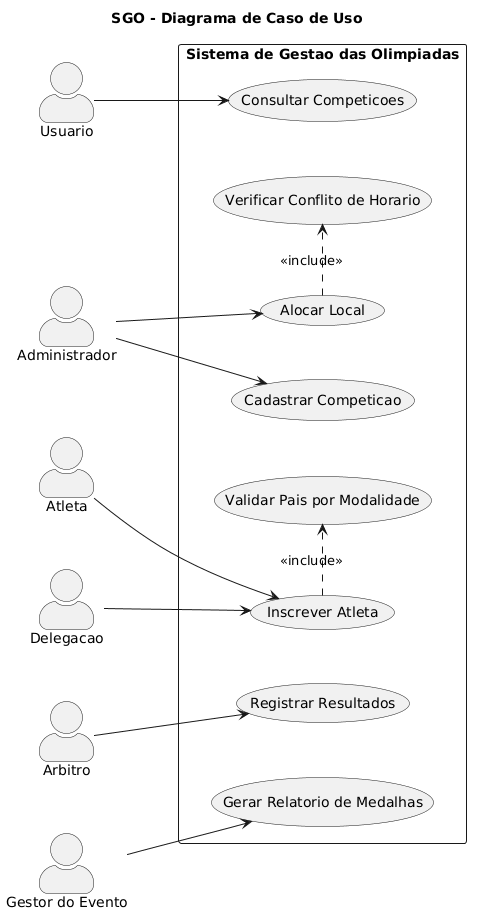
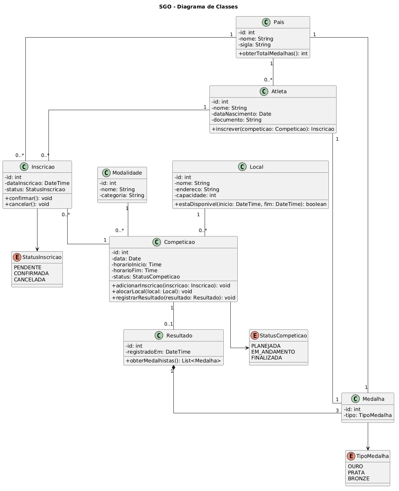
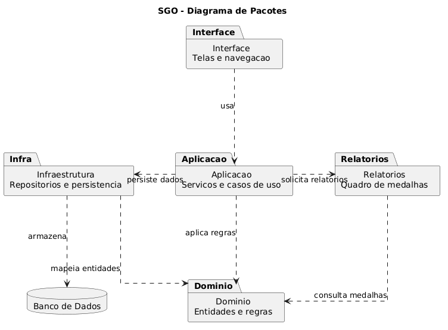
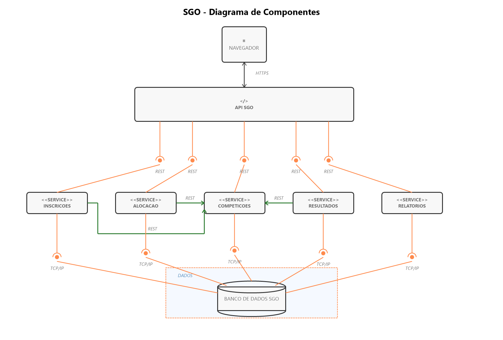
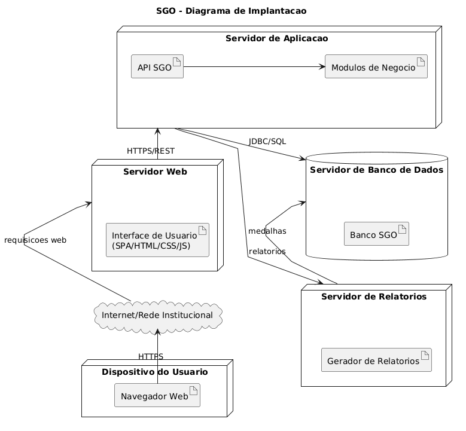

# Sistema de Gestao das Olimpiadas (SGO)

## Sobre o Projeto

O Sistema de Gestao das Olimpiadas (SGO) e uma proposta de modelagem para um trabalho da materia Projeto de Software, lecionada pelo professor João Paulo Carneiro Aramuni. O sistema permite gerenciar competicoes, inscricoes de atletas, alocacao de locais, registro de resultados e emissao de relatorios de medalhas por pais.

Este repositorio contem apenas a modelagem UML do sistema. Nao ha implementacao de codigo-fonte da aplicacao.

## Objetivo

Representar, por meio de diagramas UML, a estrutura e o funcionamento principal do SGO, considerando as regras de negocio apresentadas no enunciado do trabalho.

## Historias de Usuario

**US01 - Cadastrar competicao**  
Como administrador do sistema, quero cadastrar competicoes informando modalidade, data, horario e local, para organizar a programacao das Olimpiadas.

**US02 - Inscrever atleta**  
Como atleta ou representante de delegacao, quero inscrever um atleta em uma competicao especifica, para que ele possa participar da modalidade desejada.

**US03 - Validar pais por modalidade**  
Como sistema, quero validar que um atleta represente apenas um pais em cada modalidade, para manter a consistencia das inscricoes.

**US04 - Alocar local**  
Como administrador do sistema, quero alocar locais para as competicoes, para definir onde cada prova sera realizada.

**US05 - Verificar conflito de horario**  
Como sistema, quero verificar se um local ja esta ocupado em determinado horario, para impedir que duas competicoes ocorram no mesmo local ao mesmo tempo.

**US06 - Registrar resultados**  
Como arbitro ou responsavel pela competicao, quero registrar os atletas classificados em primeiro, segundo e terceiro lugar, para definir as medalhas da competicao.

**US07 - Gerar relatorio de medalhas**  
Como gestor do evento, quero gerar um relatorio de medalhas por pais, para acompanhar o desempenho das delegacoes.

**US08 - Consultar competicoes**  
Como usuario do sistema, quero consultar competicoes, horarios e locais, para acompanhar a programacao do evento.

## Diagramas UML

### Diagrama de Caso de Uso

O diagrama de caso de uso apresenta os principais atores do sistema e suas interacoes com as funcionalidades do SGO.



Arquivo PlantUML: [codigos/diagrama-de-caso-de-uso.puml](codigos/diagrama-de-caso-de-uso.puml)

### Diagrama de Classes

O diagrama de classes representa as principais entidades do dominio, seus atributos, metodos e relacionamentos.



Arquivo PlantUML: [codigos/diagrama-de-classes.puml](codigos/diagrama-de-classes.puml)

### Diagrama de Pacotes

O diagrama de pacotes organiza o sistema em grupos de responsabilidades, separando interface, aplicacao, dominio, infraestrutura e relatorios.



Arquivo PlantUML: [codigos/diagrama-de-pacotes.puml](codigos/diagrama-de-pacotes.puml)

### Diagrama de Componentes

O diagrama de componentes mostra os principais modulos do sistema e a comunicacao entre navegador, API, servicos e banco de dados.



Arquivo PlantUML: [codigos/diagrama-de-componentes.puml](codigos/diagrama-de-componentes.puml)

### Diagrama de Implantacao

O diagrama de implantacao apresenta uma visao da infraestrutura fisica do sistema, incluindo dispositivo do usuario, servidores, banco de dados e comunicacao entre os componentes.



Arquivo PlantUML: [codigos/diagrama-de-implantacao.puml](codigos/diagrama-de-implantacao.puml)

## Estrutura do Repositorio

```text
.
|-- README.md
|-- imagens/
|   |-- diagrama-de-caso-de-uso.png
|   |-- diagrama-de-classes.png
|   |-- diagrama-de-pacotes.png
|   |-- diagrama-de-componentes.png
|   `-- diagrama-de-implantacao.png
|-- codigos/
|   |-- diagrama-de-caso-de-uso.puml
|   |-- diagrama-de-classes.puml
|   |-- diagrama-de-pacotes.puml
|   |-- diagrama-de-componentes.puml
|   `-- diagrama-de-implantacao.puml

## Ferramenta Utilizada

Os diagramas foram modelados utilizando PlantUML.
